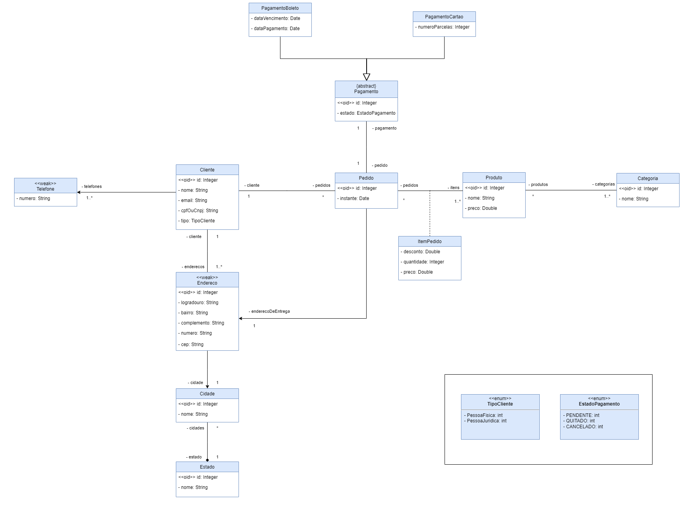

# Sistema de Pedidos

# Sobre o projeto

Projeto desenvolvido durante o curso de Modelagem de Dados UML do Prof. Nélio Alves

# Funcionalidades

- Cadastro e Listagem de clientes, pedidos do cliente, formas de pagamento, endereços de entrega, produtos comprados e suas categorias.

# Tecnologias utilizadas

## Backend

- Spring Boot
- Spring Data JPA
- H2 Database

# Modelo Conceitual

# Autor

Isabel Henrique

https://www.linkedin.com/in/isabel-henrique/